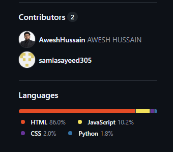
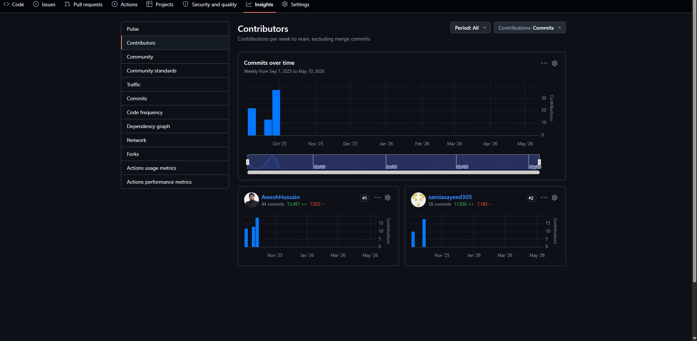

# 💧 Waterborne Disease Monitoring System

## 🏆 Smart India Hackathon (SIH) Project

### 👨‍💻 Team: CEREBRO TECH

---

## 🚀 Live Demo

🌐 [https://samiasayeed305.github.io/waterbornedisease/](https://samiasayeed305.github.io/waterbornedisease/)

---

## 📌 Project Overview

The Waterborne Disease Monitoring System is a web-based healthcare platform developed to help monitor, report, and manage waterborne diseases efficiently. The system provides role-based access for ASHA workers, volunteers, administrators, and patients.

This project was developed as part of the Smart India Hackathon (SIH) under Team CEREBRO TECH.

---

## ✅ Features

* 🔐 User Authentication System
* 👥 Multi-role Access (ASHA, Volunteer, Admin, Patient)
* ☁️ IBM Cloudant Database Integration
* 🌍 Multi-language Support
* 📱 Responsive User Interface
* 📊 Dashboard System
* 🔒 Secure Login & Registration

---

## 🛠️ Technology Stack

### Frontend

* HTML
* CSS
* JavaScript

### Backend

* Python
* Flask

### Database

* IBM Cloudant

### Deployment

* Railway
* GitHub Pages

---

## 👨‍💻 Team Members – CEREBRO TECH

* Awesh Hussain
* Samia Sayeed
* Syed Mohammad Sohaib Hussain
* SM Zaid Iqbal
* Minhaj Hussain
* Muntassar Rehan

---

## 📸 My Contributions

### Major Contributions by Awesh Hussain

* Developed the complete frontend of the project
* Built the backend using Python Flask
* Integrated IBM Cloudant database
* Implemented authentication and role-based access
* Designed and developed dashboards
* Managed deployment using Railway and GitHub Pages
* Worked on UI/UX improvements and responsiveness
* Assisted in testing and project integration

### Contribution Screenshots

*Add your screenshots inside an `images` folder*

---

## 📞 Contact & Search on Google

📧 Email: [awesh875@gmail.com](mailto:awesh875@gmail.com)

You can also find our project on Google by searching:

### **SAMAJ HEALTH SURAKSHA - LOGIN PORTAL**

---

## 🌟 Acknowledgement

This project was developed collaboratively under Team CEREBRO TECH for Smart India Hackathon (SIH 2025).
